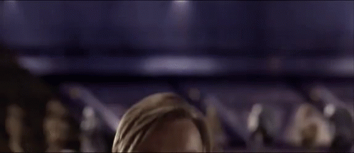

<!--
**PViniKs/pviniks** is a ✨ _special_ ✨ repository because its `README.md` (this file) appears on your GitHub profile.

Here are some ideas to get you started:

- 🔭 I’m currently working on ...
- 🌱 I’m currently learning ...
- 👯 I’m looking to collaborate on ...
- 🤔 I’m looking for help with ...
- 💬 Ask me about ...
- 📫 How to reach me: ...
- 😄 Pronouns: ...
- ⚡ Fun fact: ...
-->

## Hello there 👋

### Sobre mim
Meu nome é **Paulo Vinícius (Pviniks)**. Sou apaixonado por tecnologia, astronomia, cultura japonesa e livros. Atualmente, estou trabalhando na produção de uma estação meteorológica de baixo custo, um projeto na minha faculdade.

### Tecnologias e Aprendizado
- 🌱 Atualmente estou aprendendo: Java, Node.js
- 🔭 Aprimorando: Python, C++

### Projetos
- [Estação Meteorológica de Baixo Custo](https://github.com/PViniKs/sensor-ifcria)

### Conquistas
- Classificado para a 2ª fase da OBMEP 2021
- Participação no “Workshop Jovem Programador” realizado pela SEPROSC e Senac
- Menção Honrosa na Modalidade A da Olimpíada de Química do Rio Grande do Sul (2021)
- Medalha de Ouro Nacional na Modalidade Teórica da Olimpíada Brasileira de Robótica 2018
- Selecionado para um programa de mobilidade internacional para Portugal (fevereiro/julho de 2025)

### Hobbies e Interesses
- 🎸 Tocar guitarra
- 🌌 Astronomia
- 🎌 Cultura japonesa
- 📚 Leitura de livros
- 🎮 Jogar Minecraft e Valorant
- 📸 Fotografia
- 🏀 Basquete e Vôlei
- 🎥 Filmes de terror psicológico
- 💻 Tudo relacionado a tecnologia

### Educação
- Ensino Médio Completo
- Atualmente no 4º período do Bacharelado em Sistemas de Informação pelo Instituto Federal Catarinense (IFC) - Campus Camboriú

### Objetivos Futuros
Quero trabalhar com programação, seja de jogos ou na parte de engenharia de software, ou então na parte de cibersegurança. Além disso, quero também ter a oportunidade de morar fora, talvez na Europa. Tenho o sonho de conhecer a Áustria.

### Contato
- 📧 Email: pviniks@gmail.com
- [LinkedIn](https://br.linkedin.com/in/paulovkuss)
- [Instagram](https://instagram.com/pviniks)
- [GitHub](https://github.com/PViniKs)
- [X (Twitter)](https://x.com/pviniks)

